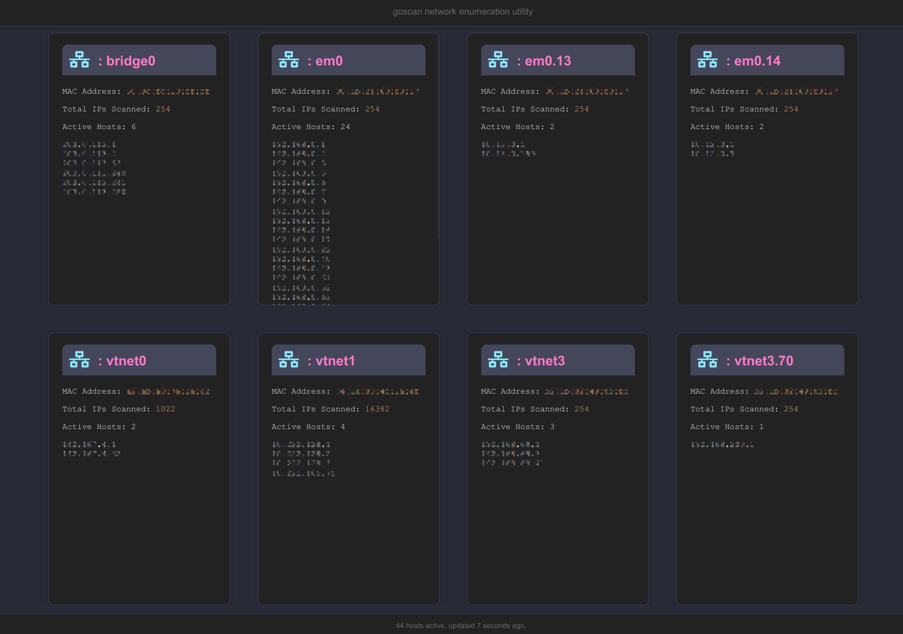

# goscan



## Overview
Goscan is a network scanner using ICMP to detect hosts. The CLI tool scans network interfaces, and the server provides a web interface for enumerating alive hosts.

## Build
- CLI tool: `go build ./cmd/goscan.go`
- Server: `go build ./web/goscan-server.go`

## Usage
**CLI Tool:**

```bash
goscan --interface eth0 --timeout 1000 --measure
goscan -i eth0 -t 1000 -m
```

If no interface is specified, it scans all available interfaces.

Server:

```bash

./goscan-server --listen-address "192.168.1.1" --listen-port "8080" --timeout 500
./goscan-server -l "192.168.1.1" -p "8080" -t 500
```

## Command Line Arguments

**CLI Tool:**
```bash
    --interface, -i: Specify network interface (optional).
    --timeout, -t: Timeout in milliseconds (default: 500).
    --measure, -m: Enable execution time measurement.
```
**Server:**
```bash
    --listen-address, -l: IP address for the server (default: "0.0.0.0").
    --listen-port, -p: Port number (default: "8080").
    --timeout, -t: Timeout in milliseconds (default: 500).
```
## Privileges

Administrator privileges are required for network scanning operations.

## MIT License 2024 Darius Niminenn